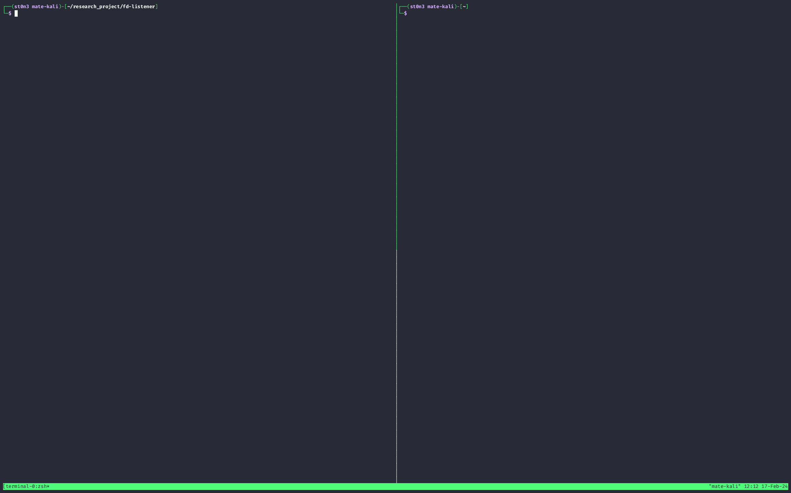

## pre-built

see https://github.com/ssst0n3/fd-listener/releases

## usage

```
./listen -a allow_cmd1 [-a allow_cmd2] -d deny_cmd1 [-d deny_cmd2]
```

e.g. 

```
./listen -a runc -a init -d root
```

## detect CVE-2024-21626

can be used to detect CVE-2024-21626 



terminal1
```
$ ./listen -a runc -a init -d bundle
```

> for older versions runc, use `./listen -a /proc/self/exe -a init -d bundle`

terminal2
```
$ docker run hello-world
```

terminal1
```
$ ./listen -a runc -a init -d bundle
[+] Found the PID: 1479716, ["runc" "init" ""]
/proc/1479716/fd/0 -> /dev/null
/proc/1479716/fd/1 -> pipe:[313721672]
/proc/1479716/fd/2 -> pipe:[313721673]
/proc/1479716/fd/3 -> socket:[313723580]
/proc/1479716/fd/4 -> pipe:[313723582]
/proc/1479716/fd/5 -> /run/docker/runtime-runc/moby/691c2730800d05562a364d4a4ccb663a6fc0f02e1565bf1732ec32c555655d98/exec.fifo
/proc/1479716/fd/8 -> /sys/fs/cgroup
----------------
/proc/1479716/fd/0 -> /dev/null
/proc/1479716/fd/1 -> pipe:[313721672]
/proc/1479716/fd/2 -> pipe:[313721673]
/proc/1479716/fd/3 -> socket:[313723580]
/proc/1479716/fd/4 -> pipe:[313723582]
/proc/1479716/fd/5 -> /run/docker/runtime-runc/moby/691c2730800d05562a364d4a4ccb663a6fc0f02e1565bf1732ec32c555655d98/exec.fifo
/proc/1479716/fd/7 -> socket:[313726299]
/proc/1479716/fd/8 -> /sys/fs/cgroup
/proc/1479716/fd/9 -> socket:[313726300]
/proc/1479716/fd/10 -> socket:[313726301]
----------------
[+] Found the PID: 1479732, ["runc" "init" ""]
/proc/1479732/fd/0 -> /dev/null
/proc/1479732/fd/1 -> pipe:[313721672]
/proc/1479732/fd/2 -> pipe:[313721673]
/proc/1479732/fd/3 -> socket:[313723580]
/proc/1479732/fd/4 -> pipe:[313723582]
/proc/1479732/fd/5 -> /run/docker/runtime-runc/moby/691c2730800d05562a364d4a4ccb663a6fc0f02e1565bf1732ec32c555655d98/exec.fifo
/proc/1479732/fd/6 -> /var/lib/docker/overlay2/2f8508499b0134cc94f077947eb6b7882b29e4c719c64330bd0b3777516cb174/merged/etc/resolv.conf
/proc/1479732/fd/7 -> anon_inode:[eventpoll]
/proc/1479732/fd/8 -> /sys/fs/cgroup
/proc/1479732/fd/9 -> pipe:[313728115]
/proc/1479732/fd/10 -> pipe:[313728115]
----------------
/proc/1479732/fd/0 -> /dev/null
/proc/1479732/fd/1 -> pipe:[313721672]
/proc/1479732/fd/2 -> pipe:[313721673]
/proc/1479732/fd/3 -> socket:[313723580]
/proc/1479732/fd/4 -> pipe:[313723582]
/proc/1479732/fd/5 -> /run/docker/runtime-runc/moby/691c2730800d05562a364d4a4ccb663a6fc0f02e1565bf1732ec32c555655d98/exec.fifo
/proc/1479732/fd/6 -> pipe:[313727408]
/proc/1479732/fd/7 -> anon_inode:[eventpoll]
/proc/1479732/fd/8 -> /sys/fs/cgroup
/proc/1479732/fd/9 -> pipe:[313728115]
/proc/1479732/fd/10 -> pipe:[313728115]
/proc/1479732/fd/11 -> pipe:[313727408]
----------------
```
